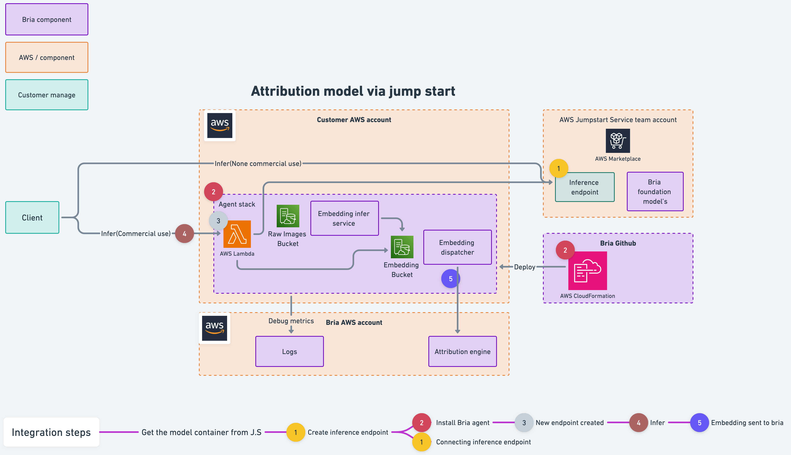

# Bria Attribution Agent


BRIA's models are trained exclusively on licensed data and provided with full copyright and privacy infringement legal coverage, subject to implementation of the Attribution Agent as provided below. The Attribution Agent installed on customer side and calculates an irreversible vector. This vector is the only data passed to BRIA. BRIA cannot reproduce any image using the vector and generated images never leave customer account. BRIA receives the information from the Attribution Agent and pays the data partners on your behalf to maintain your legal coverage.

# Deploy

### Self Hosted Inference
WIP...

### AWS Jump Start
1. Send an email to support@bria.ai
```Plain
Title - New agent registration for <name>
Subject - AWS account id, <xxx>
```
2. Deploy one of our [models](https://aws.amazon.com/marketplace/seller-profile?id=seller-ilfk2fw5juhfi) on as sagemaker endpoint
3. After you get back email from us, fill in `config.json`:
```YML
[
    {
        "ParameterKey": "LambdaEndpointName",
        "ParameterValue": "..." # Sagemaker jumpstart model endpoint arn
    },
    {
        "ParameterKey": "InferenceEndpoint",
        "ParameterValue": "..." # The name of the lambda endpoint e.g. text-2-image
    },
    {
        "ParameterKey": "ApiToken",
        "ParameterValue": "..." # Token you recived in mail
    }
]
```
4. Run `install.sh`, this will trigger another cloudformation to install the agent
```YML
# Make sure the user running the script have at least the following policy
...
```
5. You now have a lambda deployed on your account and you can start sending requests, for example:
```python
import boto3

# Set up the AWS Lambda client
lambda_client = boto3.client('lambda', region_name='your_region')

# Specify the Lambda function name
function_name = 'your_lambda_function_name'

# Input payload for the Lambda function (if needed)
payload = {
    "prompt": "A towering redwood tree in a forest, during twilight",
    "width": 512,
    "height": 512,
    "steps": 50,
    "seed": 42,
    "negative_prompt": "blue sky, people",
}

# Make the request to the Lambda function
response = lambda_client.invoke(
    FunctionName=function_name,
    InvocationType='RequestResponse',
    Payload=json.dumps(payload),
)

response_payload = json.load(response['Payload'])
print(response_payload)
```

# FAQ
### Do I have to install the Attribution Agent?
Yes,  BRIA  offers  diffuse  models  suitable  for  commercial  use,  that  are  trained  solely  on  licensed  data.  The 
Attribution Agent enables BRIA to comply with its payment obligation to its data partner, such that your use of 
the models will be fully legally covered. 

### Do I need to pay to date partners to retain the legal coverage?
No, BRIA receives the information from the Attribution Agent and pays the attribution payments to its data 
partners on our behalf, such that you retain full legal coverage. 

### Does BRIA have access to the generated images?
No, generated images never leave your account. The Attribution Agent is installed on the customer side and 
turns any generated image into an irreversible vector. This irreversible vector is the only information being 
passed to BRIA. BRIA cannot reproduce any image using the irreversible vector. This information is required 
solely to meet the payment obligations to data partners. 

### Is there any performance impact caused by the Attribution Agent?
No, the Attribution Agent operates offline such that real-time inference and generation are not impacted at all.

### Can the Attribution Agent erase or modify my image generations?
No, the Attribution Agent extracts the irreversible vector from a copy of the generated image on the customer 
side. Once extracted, such copy is permanently deleted to avoid any cost or privacy concerns.
