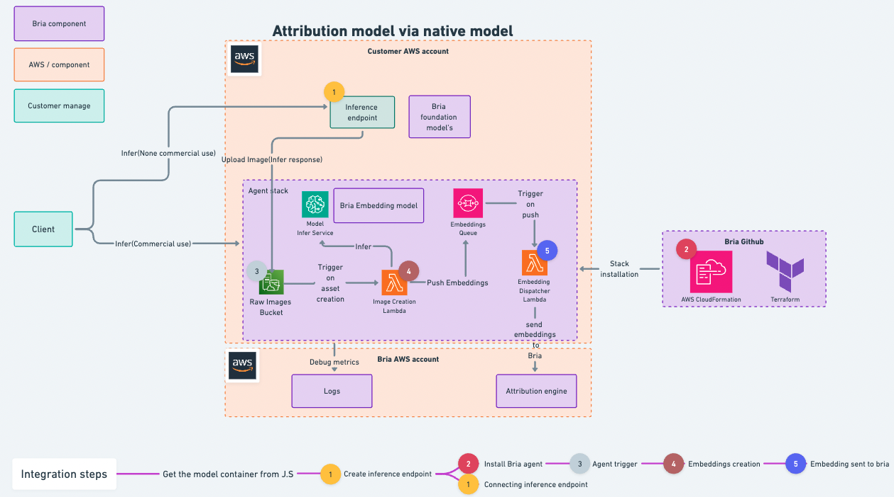
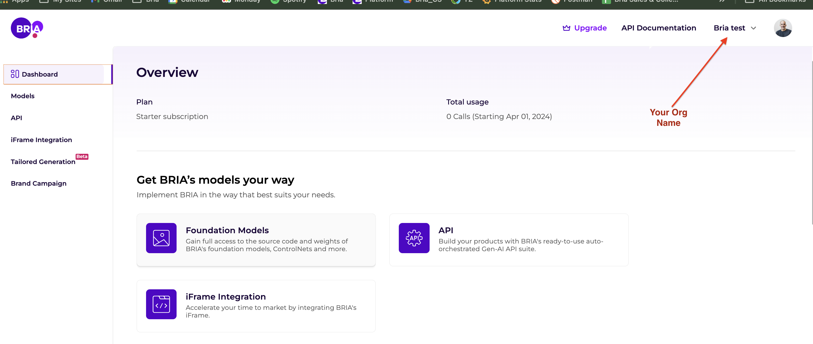
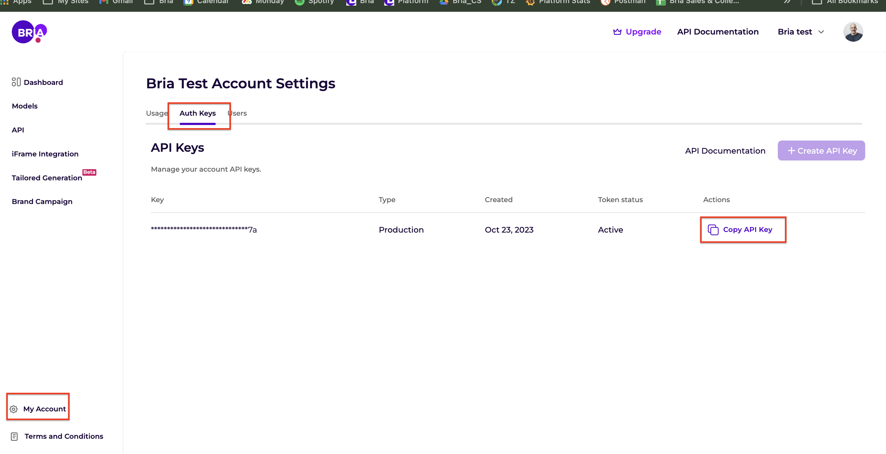

# Bria Attribution Agent


BRIA's models are trained exclusively on licensed data and provided with full copyright and privacy infringement legal coverage, subject to implementation of the Attribution Agent as provided below. The Attribution Agent installed on customer side and calculates an irreversible vector. This vector is the only data passed to BRIA. BRIA cannot reproduce any image using the vector and generated images never leave customer account. BRIA receives the information from the Attribution Agent and pays the data partners on your behalf to maintain your legal coverage.

## Deploy

### Prerequisites
1. Create a user and organization on BRIA platform (If you already have an organization created in BRIA platform please skip this step and proceed to step 2)
    1. Go to https://platform.bria.ai and register to BRIA
    2. You will be asked to provide an organization name under the registration process (after you log in the organization name will appear on the top right corner)
       
        

2.  Send an email to support@bria.ai
    ```Plain
    Title - New agent registration for <organization name you created in BRIA>
    Subject - AWS account id
    ```
3. **(Important)** - After sending the above information wait for a confirmation email from BRIA before you proceed with the next deployment steps. 

4. Extract your BRIA private API token:
    1. Login to the BRIA platform https://platform.bria.ai/
    2. Go to my account -> Auth keys -> Copy API key
       
        

### Terraform

1. Create an AWS Access Token, if it hasn't been done yet. The Access Token should have Administrator access to the AWS account.
2. Open a command line / terminal and export the following environment variables (replace xxx with your `ACCESS_KEY_ID` and yyy with your `SECRET_ACCESS_KEY` from Step 1):

```
export AWS_ACCESS_KEY_ID=xxx
export AWS_SECRET_ACCESS_KEY=yyy
export AWS_DEFAULT_REGION=us-east-1
```

3. Navigate to `agent` repository in the terminal.
4. (Optional) Setup Terraform remote state:

By default, Terraform will use a local state file to store the Terraform state, but when working in a team with multiple people, it's recommended to setup remote state for Terraform. You can learn more about this [here](https://developer.hashicorp.com/terraform/language/settings/backends/s3). We recommend that you create a file `backend.tf` in the directories listed below (`aws/terraform/native` or `aws/terraform/jumpstart`) and fill in the information according to this example:

```
terraform {
  backend "s3" {
    bucket = "mybucket"
    key    = "path/to/my/key"
    region = "us-east-1"
  }
}
```

The bucket `mybucket` should be a bucket dedicated to storing terraform remote state files and `path/to/my/key` should point to a local aws credentials file.

#### Self Hosted Inference

1. Navigate to the folder `aws/terraform/native`
2. Run `terraform apply`
3. Enter the `bria-api-token` when prompted
4. Confirm with `yes` after reviewing the Terraform plan

#### AWS Jump Start

1. Navigate to the folder `aws/terraform/jumpstart`
2. Run `terraform apply`
3. Enter the `bria-api-token` when prompted
4. Confirm with `yes` after reviewing the Terraform plan

### CloudFormation

#### Self Hosted Inference
1. After you get back email from us, fill in `config.json`:
```YML
[
    {
        "ParameterKey": "ApiToken",
        "ParameterValue": "N/A" # Token you recived in mail
    },
    {
        "ParameterKey": "ModelVersion",
        "ParameterValue": "N/A" # AI Model version
    }
]
```
2. After you get back email from us, fill in `config.json`:
```YML
[
    {
        "ParameterKey": "InferenceEndpoint",
        "ParameterValue": "..." # Sagemaker jumpstart model endpoint arn
    },
    {
        "ParameterKey": "ApiToken",
        "ParameterValue": "..." # Token you recived in mail
    }
]
```

#### AWS Jump Start
1. Deploy one of our [models](https://aws.amazon.com/marketplace/seller-profile?id=seller-ilfk2fw5juhfi) on as sagemaker endpoint
2. After you get back email from us, fill in `config.json`:
```YML
[
    {
        "ParameterKey": "InferenceEndpoint",
        "ParameterValue": "..." # Sagemaker jumpstart model endpoint arn
    },
    {
        "ParameterKey": "ApiToken",
        "ParameterValue": "..." # Token you recived in mail
    }
]
```
3. Run `install.sh`, this will trigger cloudformation to install the agent
```YML
# Make sure the user running the script have at least the following policy
{
    "Version": "2012-10-17",
    "Statement": [
        {
            "Effect": "Allow",
            "Action": [
                "cloudformation:*"
                "iam:CreateRole"
            ],
            "Resource": "*"
        }
    ]
}
...
```

## Testing

After deploying using one of the methods described above, you are now ready to test your setup.

### Self Hosted Inference

You now have Bria agent triggered by S3 bucket on '/images' folder, here is a snippet of uploading an image to the bucket, for example:
```python
import boto3

def upload_image_to_bria_bucket():
    s3_client = boto3.client('s3')
    s3_client.upload_file(file_name, "aws-bria-agent-results", 'images/' + object_name)

```

### AWS Jump Start

You now have a lambda deployed on your account and you can start sending requests, for example:

```python
import boto3
import requests
from requests_aws4auth import AWS4Auth


region = 'us-east-1' # your region name
service = 'execute-api' 
session = boto3.Session()
credentials = session.get_credentials()
aws_access_key_id = credentials.access_key
aws_secret_access_key = credentials.secret_key
aws_session_token = credentials.token

# Create the AWS Auth object
awsauth = AWS4Auth(aws_access_key_id, aws_secret_access_key, region, service, session_token=aws_session_token)

# Specify api gateway url
host = '<The host created by cloud formation>'
endpoint = f"https://{host}/PROD/jumpstart-agent"

# Input payload for the Lambda function (if needed)
payload = {
    "prompt": "A towering redwood tree in a forest, during twilight",
    "width": 512,
    "height": 512,
    "steps": 50,
    "seed": 42,
    "negative_prompt": "blue sky, people"
}

# Make the request to the Lambda function
response = requests.post(endpoint, auth=awsauth, json=payload)
response_data = response.json()
print(response_data)
```
