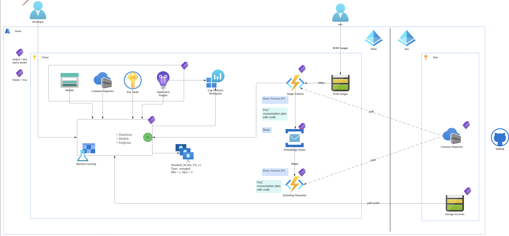
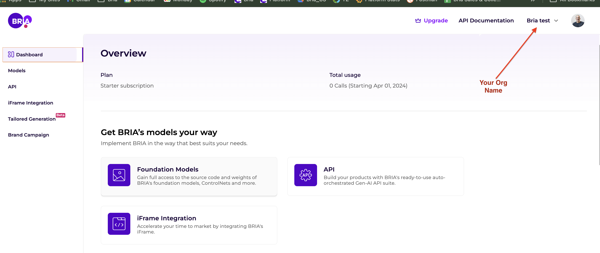
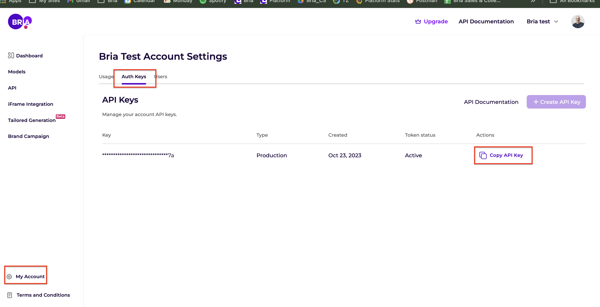

# Bria Attribution Agent


BRIA's models are trained exclusively on licensed data and provided with full copyright and privacy infringement legal coverage, subject to implementation of the Attribution Agent as provided below. The Attribution Agent installed on customer side and calculates an irreversible vector. This vector is the only data passed to BRIA. BRIA cannot reproduce any image using the vector and generated images never leave customer account. BRIA receives the information from the Attribution Agent and pays the data partners on your behalf to maintain your legal coverage.

## Deploy

### Prerequisites
1. Azure CLI - if not already exist follow the [Manual](https://learn.microsoft.com/en-us/cli/azure/install-azure-cli).
2. Terraform - if not exist please follow the [Manual](https://developer.hashicorp.com/terraform/tutorials/aws-get-started/install-cli).
3. Create a user and organization on BRIA platform (If you already have an organization created in BRIA platform please skip this step and proceed to step 2)
    1. Go to https://platform.bria.ai and register to BRIA
    2. You will be asked to provide an organization name under the registration process (after you log in, the organization name will appear on the top right corner)

        

4.  Send an email to support@bria.ai
    ```Plain
    Title - New agent registration for <organization name you created in BRIA>
    Subject - AWS account id
    ```
5. **(Important)** - After sending the above information wait for a confirmation email from BRIA before you proceed with the next deployment steps. 

6. Extract your BRIA private API token:
    1. Login to the BRIA platform https://platform.bria.ai/
    2. Go to my account -> Auth keys -> Copy API key
    
        


### Terraform

1. Using Azure CLI login to your Azure tenant and switch to the destination subscription.
    ```
    az login --tenant yourtenant.com
    az account set --subscription sub_id
    ```
2. Clone the `agent` repository.
3. Navigate to `agent` repository in the terminal.
4. (Optional) Setup Terraform remote state:

By default, Terraform will use a local state file to store the Terraform state, but when working in a team with multiple people, it's recommended to setup remote state for Terraform. You can learn more about this [here](https://developer.hashicorp.com/terraform/language/settings/backends/azurerm). We recommend that you create a file `backend.tf` in the directort listed below (`azure/terraform/native`) and fill in the information according to this example:

```
terraform {
  backend "azurerm" {
    resource_group_name  = "StorageAccount-ResourceGroup"
    storage_account_name = "myaccount"
    container_name       = "tfstate"
    key                  = "prod.terraform.tfstate"
  }
}
```

The Storage Account `myaccount` should be a container dedicated to storing terraform remote state files.

#### Self Hosted Inference

1. Navigate to the folder `azure/terraform/native`
2. create a `parameters.auto.tfvars` file with the following data inside (provided by BRIA):
    ```
    bria_spn_tenant_id                     = ""
    bria_spn_client_id                     = ""
    bria_spn_client_secret                 = ""
    bria_model_source_storage_account_name = ""
    bria_model_source_container_name       = ""
    bria_api_token                         = ""
    ml_vm_size                             = ""
    ```
By using the above values the terraform will create a storage account and container.
If you want to use an existing storage account add this section to the above `parameters.auto.tfvars`:

```
    image_storage_account_resource_group_name = ""
    images_storage_account_name               = ""
    images_container_name                     = ""
```

3. Run `terraform init`
4. Run `terraform apply`
5. Confirm with `yes` after reviewing the Terraform plan
6. Wait for the `Apply complete!` message (~ 20 minutes)

## Testing
After deploying using one of the methods described above, you are now ready to test your setup.

### Self Hosted Inference
You now have Bria agent triggered by storage account container on '/images' folder, here is a snippet of uploading an image to the storage account container, for example:

```
from azure.storage.blob import BlobServiceClient
import os

def upload_image_to_azure_container(file_name, object_name, connection_string, container_name):
    """
    Uploads an image to a specified container in Azure Blob Storage.

    Parameters:
    - file_name (str): Path to the local file to upload.
    - object_name (str): Name for the file in the storage container.
    - connection_string (str): Azure Blob Storage connection string.
    - container_name (str): Name of the Azure Blob Storage container.
    """
    # Create a BlobServiceClient using the provided connection string
    blob_service_client = BlobServiceClient.from_connection_string(connection_string)

    # Get a client to interact with the specified container
    container_client = blob_service_client.get_container_client(container_name)

    # Create a blob client for our uploading process
    blob_client = container_client.get_blob_client('images/' + object_name)

    # Upload the file to Azure Blob Storage
    with open(file_name, "rb") as data:
        blob_client.upload_blob(data, overwrite=True)
    
    print("Upload completed!")
```
